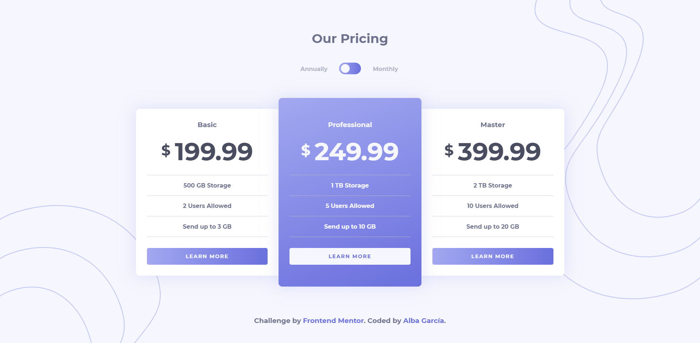
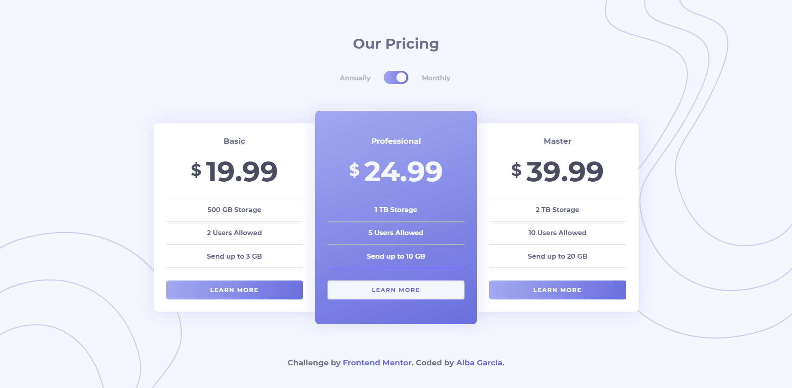
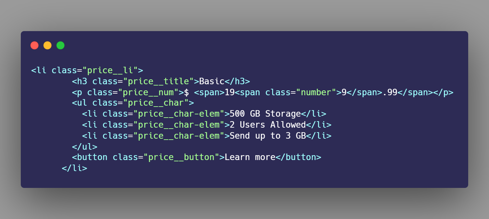
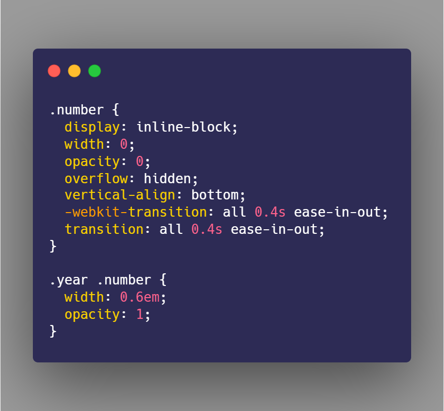
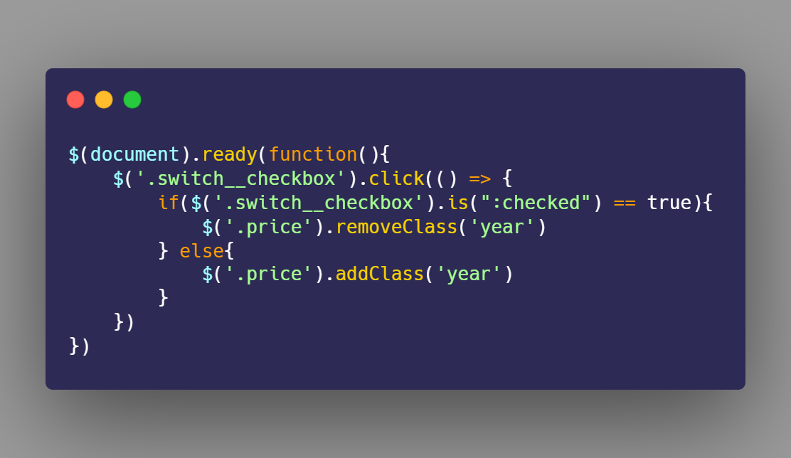

# Frontend Mentor - Pricing component with toggle solution

This is a solution to the [Pricing component with toggle challenge on Frontend Mentor](https://www.frontendmentor.io/challenges/pricing-component-with-toggle-8vPwRMIC). Frontend Mentor challenges help you improve your coding skills by building realistic projects.

## Table of contents

- [Overview](#overview)
  - [The challenge](#the-challenge)
  - [Screenshot](#screenshot)
  - [Links](#links)
- [My process](#my-process)
  - [Built with](#built-with)
  - [What I learned](#what-i-learned)
  - [Continued development](#continued-development)
- [Author](#author)
- [Acknowledgments](#acknowledgments)

## Overview

### The challenge

Users should be able to:

- View the optimal layout for the component depending on their device's screen size
- Control the toggle with both their mouse/trackpad and their keyboard
- **Bonus**: Complete the challenge with just HTML and CSS

### Screenshot

### Links

- Solution URL: [Add solution URL here](https://www.frontendmentor.io/solutions/pricing-component-with-toggle-using-html-scss-and-jq-_78UzfSgD)
- Live Site URL: [Add live site URL here](https://pricing-component-albagr.netlify.app/)

## My process

### Built with

- Semantic HTML5 markup
- CSS custom properties
- Flexbox
- [BEM methodology](http://getbem.com/)
- [SASS](https://sass-lang.com/)
- [Jquery](https://jquery.com/)

### What I learned

While doing this challenge, I tried to give a bit more atention to the animations in it. I think the most challengin one was how to show the change between the different prices, I strugle deciding what I would do and tried a lot of different things. In the end this idea came to my mind and I'm really proud of how it turned out! I don't know if there is a better way to do it than this, but I think it works pretty nicely!

### Continued development

I want to keep focusing in little animations that bring more happiness to a web, while improving my JQuery skills in the meantime. I'm still a bit scaerd to take harder challenges, but I hope little by little I'll be ready soon!

## Author

- Website - [Alba García](https://koalba.netlify.app/)
- Frontend Mentor - [@koalba](https://www.frontendmentor.io/profile/koalba)
- ArtStation - [Alba García](https://www.artstation.com/koal_art)
- Instagram - [Koal_Art](https://www.instagram.com/koal_art/)

## Acknowledgments

- [Edu Fierro](https://www.youtube.com/c/EduardoFierroPro) - My Master's degree teacher! He also uploads programming videos, he has (and is) teaching me A LOT during this months, I feel a lot more confortable writing html, css and jq! (Spanish)
